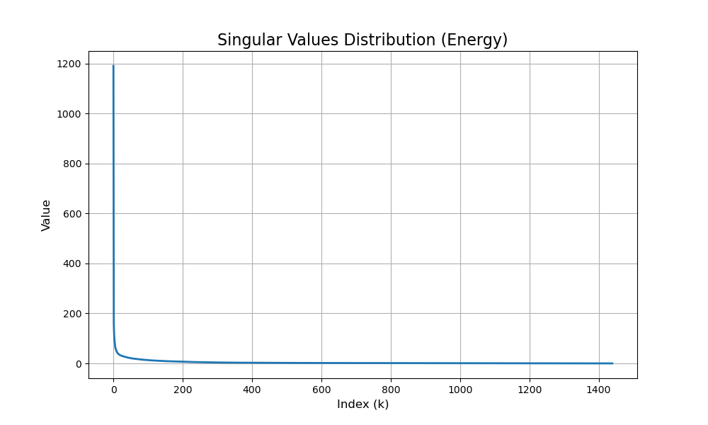
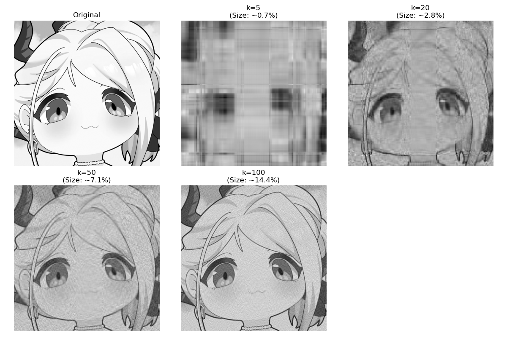

# 基於奇異值分解 (SVD) 的影像壓縮實作
# Image Compression via Singular Value Decomposition

**課程名稱：** [程式與數學]
**作者：** [張政榮/111310546]
**日期：** 2026/01/03  

---

## 1. 動機 (Motivation)

在數位時代，高解析度的影像佔據了大量的儲存空間與傳輸頻寬。如何有效地減少影像數據量，同時保留肉眼可見的主要特徵，是資訊工程與數據科學的重要課題。

雖然現代有許多成熟的壓縮格式（如 JPEG, PNG），但其背後的數學原理往往被忽視。本專案旨在探討 **線性代數 (Linear Algebra)** 中的 **奇異值分解 (Singular Value Decomposition, SVD)** 技術，證明數學理論並非紙上談兵，而是能實際應用於「降維」與「特徵提取」。透過 SVD，我們可以將一張複雜的圖片矩陣拆解，並透過捨棄次要的奇異值來達到壓縮效果。

## 2. 數學原理 (Mathematical Background)

數位影像在電腦中本質上是一個矩陣（Matrix）。對於一張 $m \times n$ 的灰階圖片，我們可以將其視為矩陣 $A$。

### 2.1 SVD 定義
根據線性代數理論，任意實數矩陣 $A$ 皆可分解為三個矩陣的乘積：

$$A = U \Sigma V^T$$

其中：
* **$U$ (Left Singular Vectors)**：是一個 $m \times m$ 的正交矩陣，代表圖片在**垂直方向**的特徵基底。
* **$\Sigma$ (Singular Values)**：是一個 $m \times n$ 的對角矩陣，對角線上的元素 $\sigma_1, \sigma_2, \dots, \sigma_r$ 即為**奇異值**。
* 
    * 特性：$\sigma_1 \ge \sigma_2 \ge \dots \ge 0$。
    * 物理意義：奇異值的大小代表了該特徵對圖片的「重要程度」或「能量」。
* **$V^T$ (Right Singular Vectors)**：是一個 $n \times n$ 的正交矩陣，代表圖片在**水平方向**的特徵基底。

### 2.2 低秩近似 (Low-Rank Approximation)
SVD 的強大之處在於我們可以利用**截斷 (Truncation)** 來逼近原始矩陣。若我們只保留前 $k$ 個最大的奇異值，則矩陣 $A$ 可以被近似為 $A_k$：

$$A_k = \sum_{i=1}^{k} \sigma_i u_i v_i^T$$

由於 $\sigma$ 的數值下降得非常快，後面的項（細節與雜訊）對影像的貢獻極小。因此，我們可以使用遠小於原始像素數量的數據來重建影像，這就是 SVD 壓縮的核心原理。

## 3. 專案結構與實作 (Implementation)

本專案使用 Python 語言，結合 `NumPy` 進行矩陣運算與 `Matplotlib` 進行視覺化。

### 檔案說明
* `svd_compression.py`: 主要程式碼，包含 SVD 分解與圖片重建函式。
* `README.md`: 專案報告與說明。
* `test_image.jpg`: 測試用的原始圖片。

### 核心演算法
1.  **讀取圖片**：將圖片轉換為灰階矩陣。
2.  **SVD 分解**：使用 `numpy.linalg.svd` 計算 $U, \Sigma, V^T$。
3.  **奇異值篩選**：保留前 $k$ 個奇異值，將剩餘的數值視為 0。
4.  **矩陣重建**：計算 $A_k = U_k \Sigma_k V_k^T$ 還原壓縮後的圖片。

## 4. 實作結果 (Results)

### 4.1 奇異值分佈分析
下圖展示了奇異值的大小分佈。可以看到數值在最初幾項急劇下降，這證實了**圖片的大部分資訊（能量）僅集中在前少數幾個特徵上**。

)

### 4.2 不同 k 值的壓縮效果對比
我們測試了保留不同數量 ($k$) 的奇異值，結果如下：

* **Original**: 原始清晰圖片。
* **k=5**: 僅保留最主要的 5 個特徵，圖片極度模糊，僅能看出光影輪廓。
* **k=20**: 輪廓逐漸清晰，但仍有明顯的區塊感。
* **k=50**: 圖片細節已相當完整，肉眼難以分辨與原圖的差異，但所需的數據量大幅減少。

### 4.3 數據分析
| 保留奇異值數量 (k) | 視覺品質 | 壓縮率 (估算) |
| :--- | :--- | :--- |
| **5** | 模糊/僅輪廓 | ~2% |
| **20** | 可辨識/有雜訊 | ~8% |
| **50** | 清晰/細節完整 | ~18% |
| **Original** | 原始畫質 | 100% |

*(註：壓縮率視圖片解析度而定，此為近似值)*

## 5. 結論 (Conclusion)

本實作成功展示了 SVD 在影像處理上的應用。
1.  **數學與應用的連結**：證明了抽象的矩陣分解可以轉化為具體的視覺應用。
2.  **壓縮效益**：我們發現通常只需要保留前 10% - 20% 的奇異值，就能還原出高品質的影像。
3.  **未來展望**：目前的實作僅針對灰階圖片，未來可延伸至 RGB 三原色通道的獨立壓縮，或探討 SVD 在去噪 (Denoising) 方面的應用（因為雜訊通常對應於數值極小的奇異值）。

# 執行程式
python svd_compression.py
